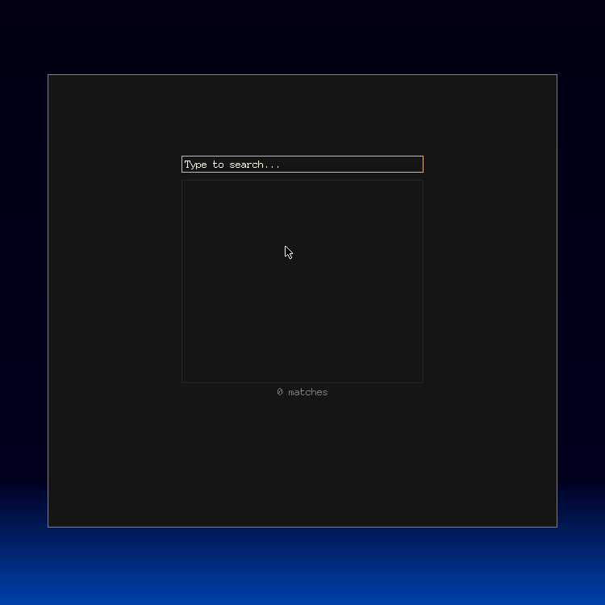

# mangl

Mangl is a graphical man page viewer based on the mandoc library (https://mandoc.bsd.lv/).



It uses OpenGL to display man pages with clickable hyperlinks and smooth scrolling.

Features:
* hyperlinks to other man pages
* browsing history
* colored text
* truetype support
* draggable scrollbar
* keyboard and mouse interaction

## Building

Install prerequisites if necessary (pkg-config, zlib, OpenGL, FreeGLUT and FreeType headers and
libraries). On Debian systems run:

```
sudo apt install pkg-config libz-dev libgl-dev freeglut3-dev libfreetype6-dev
```

First run `./configure` in mandoc folder:

```
cd mandoc
./configure
```

Then run `make` in root folder:

```
cd ..
make
```

If it fails, please check the Makefile for proper inclusion of OpenGL libraries.

Run
```
sudo make install
```
to copy the executable to `/usr/local/bin/` or copy and use the `mangl` binary as you like.

## Keyboard & mouse commands

* scrolling one step: `j`, `k`, `up-arrow`, `down-arrow`
* scrolling one whole page: `space`, `shift-space`, `page-up`, `page-down`
* scrolling to the beginning or the end of the man page: `gg`, `G`, `Home`, `End`
* to go to the previous man page: `b`, `escape`, `right-mouse-click`
* to go to the next man page: `left-mouse-click` on the link, `f` to go to the page opened before going back
* to go to search screen: `Ctrl-f`
* to quit: `q`, `Ctrl-c`, `Ctrl-d`

## ~/.manglrc

Configuration can be specified with `~/.manglrc` file. Here is an example
(reproduces default settings):

```
font: Anonymous Pro
font_size: 10
gui_scale: 1
line_spacing: 1
initial_window_rows: 40
color_background: #151515
color_foreground: #fdfde8
color_bold: #a4d4f1
color_italic: #ffce79
color_dim: #7b7b7b
color_scrollbar_background: #262626
color_scrollbar_thumb: #454545
color_scrollbar_thumb_hover: #545454
color_link: #4515ff
color_gui_1: #ebb470
color_gui_2: #8fbfdc
```

`font` parameter uses the `fc-match` external program to find the font file. The font
file can also be specified directly.

## Command line arguments

```
mangl     - open the viewer in search mode
mangl [man page name] - open the viewer in man page mode with man page opened
mangl [section name] [man page name] - open the man page from the specified section, e.g. mangl 3 printf
```

