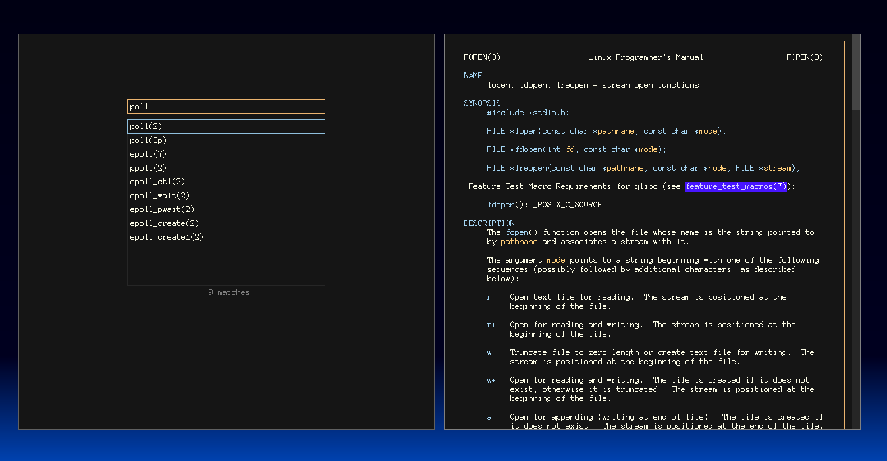

# mangl

This is a graphical man page viewer based on mandoc (https://mandoc.bsd.lv/).



It uses OpenGL to display man pages with clickable hyperlinks and smooth scrolling.

Features:
* links to other manpages
* stack browsing (history) with `f` and `b` commands for forwards and backwards
* colored text
* draggable scrollbar
* keyboard commands: `q` quit, scrolling with `j`, `k`, `space`, `shift-space`, `gg`, `G`

## Building

First run `./configure` in mandoc folder:

```
cd mandoc
./configure
```

Then run `make` in root folder:

```
cd ..
make
```

If it fails check the Makefile for proper inclusion of GL libraries.

Copy and use `mangl` binary as you like.

